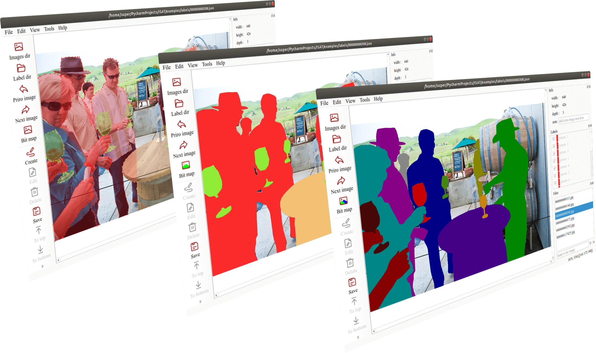
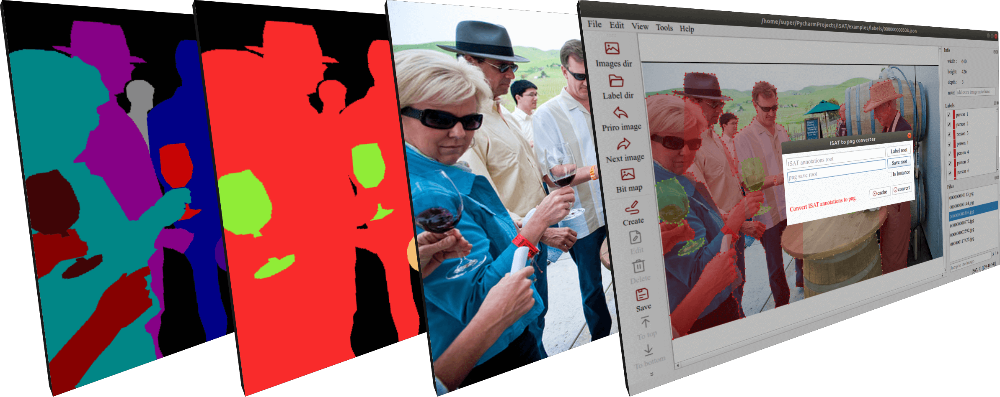

# ISAT图像分割标注工具



基于多边形的图像分割标注工具，支持实例分割与语义分割。

## 特点
主要对语义标注过程中存在标注重复部分进行优化。
自己标注过分割样本，或者使用coco分割数据集的朋友，肯定遇到过标注多边形之间存在覆盖的问题。
本项目通过引入多边形图层高低的方式，让上层的多边形覆盖下层多边形，从而保证每一个像素的类别都是单一的，降低数据的干扰。

* 支持对多边形图层进行调整(图层置顶或置底)。
* 标注文件转png单通道图(支持实例与语义)。
* 支持滚轮缩放，左键拖动图片。
* 类别标签导入与导出，方便不同任务之间快速切换。
## 安装
### 1. 源码运行
```shell
git clone https://github.com/yatengLG/ISAT.git
cd ISAT
conda create -n ISAT python==3.8
conda activate ISAT
pip install -r requirements.txt
python main.py
```
### 2. 下载打包好的exe
- 2.1 点击[链接](https://github.com/yatengLG/ISAT/releases/download/v1.0.0/ISAT_windows.zip)下载ISAT_windows.zip
- 2.2 解压
- 2.3 双击ISAT/main.exe运行

## 导出标注文件
ISAT标注文件采用json格式，存储信息包括：图片名、图片尺寸、图片额外说明、标注目标类别、标注目标实例id、标注目标多边形顶点等。

软件内置了标签转换工具，可以将ISAT标签文件转换为png单通道图

转换后的单通道图与原图分辨率一致，语义单通道图中每个像素值为该像素对应的类别id；实例单通道图中每个像素为该像素对应的实例id。


